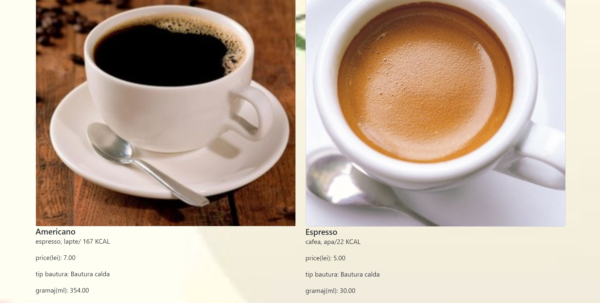
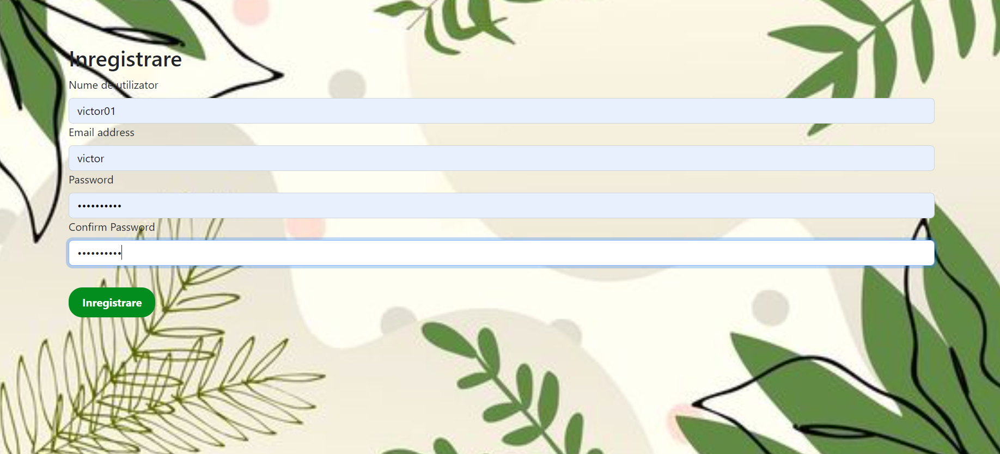
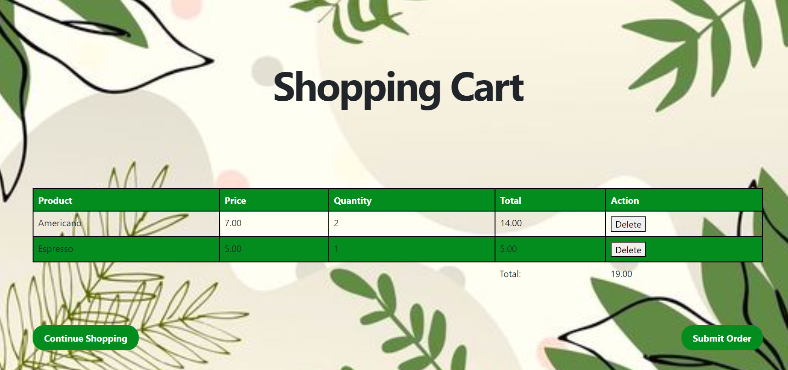
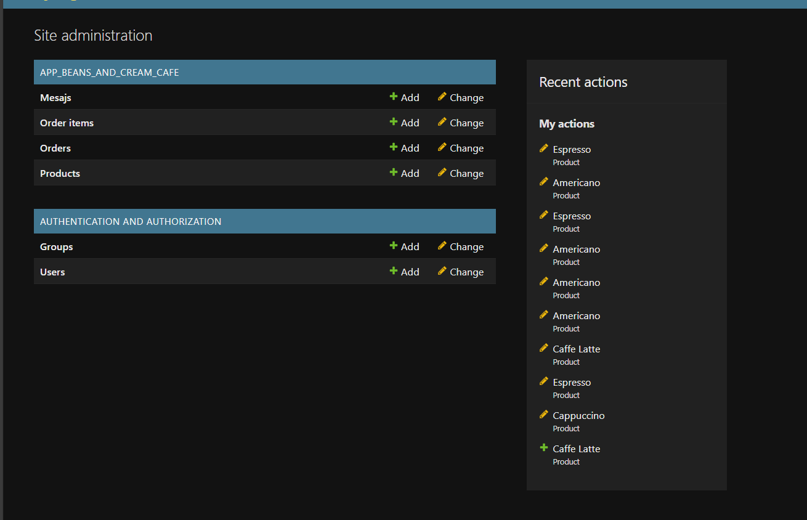

# Beans and Cream Cafe

Beans and Cream Cafe este un magazin online cu produse de cafenea, dezvoltat folosind python si framework-ul Django.
## 1. Descriere

Beans and Cream Cafe este o platforma online unde utilizatorii pot comanda produse  doar daca sunt autentificati.
Utilizatorii pot naviga prin pagina de produse, pot trimise mesaje administratorului platformei, pot adauga produse in 
cosul de cuparaturi, si pot trimite comanda rapid si usor

## 2. Screenshots Beans and Cream Cafe

pagina de produse

pagina de autentificare

pagina pentru cosul de cumparaturi

pagina de administrator

### 3. Download si Instalare

Cloneaza acest repository local, in folderul cu proiecte Python:

``
git clone https://github.com/victorgabi01/Beans_and_Cream_Cafe.git
Pentru a instala dependentele, ruleaza:

``
pip install -r requirements.txt``

### 4. Dezvoltare unui proiect folosind framework-ul Django

- Instalare framework Django  - va trebui sa va asigurati ca aveti instalat acest framework si sa rulati comanda de mai jos

``pip install django``

- Creare proiect folosind Django - cand creati un proiect va trebui sa folositi terminalul si sa rulati comanda de mai jos

``django-admin startproject nume_proiect``

- Crearea unei aplicatiei - inainte de a crea aplicatia va trebui sa mergeti in directorul proiectului folosind comanda cd nume_proiect, apoi veti rula comanda de mai jos in terminal

``python manage.py startapp nume_aplicatie``

- Dupa ce creem aplicatia mergem in fisierul settings.py sa face setarile aplicatiei si sa denumim baza de date 
- Definirea modelelor - dupa ce definim modelele structurii bazei de date in fisierul models.py vom rula urmatoarea comanda

``python manage.py makemigrations``

``python manage.py migrate``

- Rularea aplicatiei se va face folosind comanda de mai jos

``python manage.py runserver``

- Creare superuser - acesta ne va ajuta sa avem acces la interfata Django admin 

``python manage.py createsuperuser``

